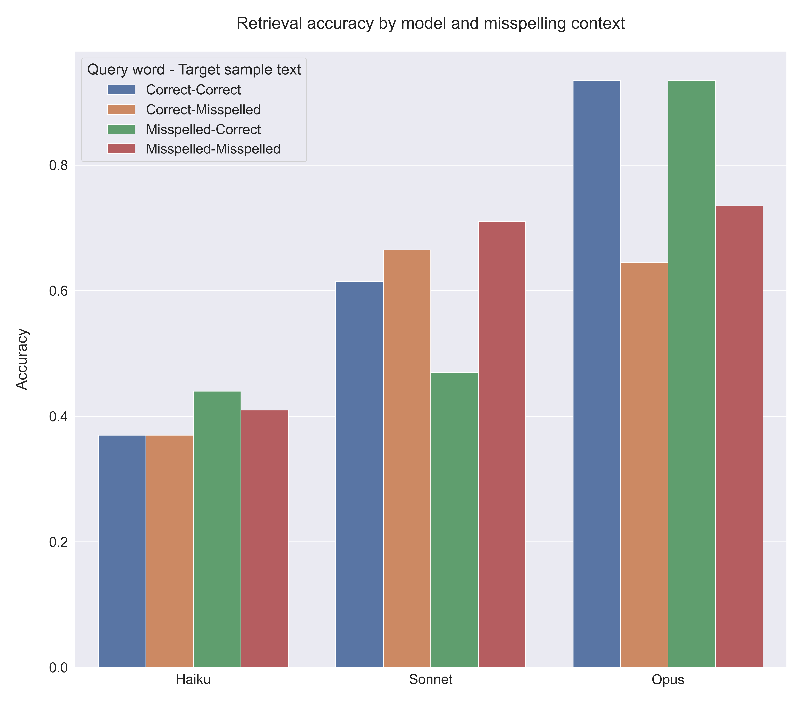

## Impact of typos on LLM task performance

A collection of experiments studying the impact of typographical errors (typos) on various task performance. Some examples of typos include [common misspellings in English](https://en.wikipedia.org/wiki/Commonly_misspelled_English_words) or other languages, [homophones](https://www.writersdigest.com/write-better-fiction/homophones-examples-for-writers), incorrect use of apostrophes, and generic typing errors. Such typos may be inadvertantly introduced during speech-to-text transcription of a non-native speaker, produced by individuals with learning disabilities or dyslexia, or generated without proofreading.

### Experiment setup

- Generate sample text containing the correctly spelled word `x` exactly once (baseline)
- Create a copy of the sample text with `x` replaced with its common misspelled variant `y`
- Retrieval task: ask the model to return the preceding and following words around `x` (or `y`)
- Retrieval accuracy aims to test the robustness of the tokenizer to typos and model's reasoning ability to understand the context
- Measure the proportion of correct responses for each scenario

### Results
- Typos can have a significant impact on naive retrival tasks, such as retrieving the preceding and following words around a target word.
- Unsurprisingly, more capable models are better at handling typos and are more accurate in their responses.
- Interestingly, generic typos with no impact on the meaning of the word give `Opus` a harder time when the misspelling is found in the target sample text than when it is found in the query word itself.
- `Opus` retrieval accuracy for the preceding word is significantly higher than for teh following word.
- When more subtle misspellings that alter the meaning of the word are used, `Opus` performs better in retrieving the following word than the preceding word.

### Do common misspellings in English matter for recall? ([Scenario #1](/experiments/scenario_1/))

| Correct spelling | Common misspelling |
|:--------:|:--------:|
|    beautiful     |    beatiful     |
|    Caribbean     |    Carribean     |
|    cemetery     |    cemetary     |
|    occurrence     |    occurrance     |
|    publicly     |    publically     |

Figure 1. Retrieval accuracy of Claude-3 family models in increasing reasoning capabilities (x-axes) for the preceding and following words around the user-provided query word `x` in the target sample text `y`. Misspelling context (colors) indicate spelling status of the query word and target sample text. Each bar shows the aggregate retrieval accuracy across 100 runs (20 samples per query word) for each mispelling context.

Figure 2. Retrieval accuracy of the most capable model (`Opus`) in the preceding and following words around the user-provided query word `x` in the target sample text `y`. Note that the retrieval accuracy is significantly higher for the preceding word than for the following word irrespective of the misspelling context.

### How about common misspellings with distinct meaning? ([Scenario #2](/experiments/scenario_2/))

| Correct spelling | Common misspelling |
|:--------:|:--------:|
|    affect     |    effect     |
|    lose     |    loose     |
|    principle     |    principal     |
|    then     |    than     |
|    weather     |    whether     |

### Homophones: same pronounciation, different spelling ([Scenario #3](/experiments/scenario_3/))

<b>Homophone dataset</b>

| First word | Second word |
|:--------:|:--------:|
|    cite     |    sight     |
|    hole     |    whole     |
|    its     |    it's     |
|    role     |    roll     |
|    soul     |    sole     |
|    steal     |    steel     |
|    tail     |    tale     |
|    waist     |    waste     |

### Notes

**Model family**: Only the `opus` model is used for generating sample texts. The `haiku` and `sonnet` models failed to follow the system and/or user prompts and sometimes included the word `x` more than once. `opus` had difficulty with some misspellings but was otherwise accurate.

- `opus`: `claude-3-opus-20240229`
- `sonnet`: `claude-3-sonnet-20240229`
- `haiku`: `claude-3-haiku-20240307`

**System and user prompts**

  
<b>Sample text generation</b>

  

  <b>System prompt</b>: Please make sure to use the maximum number of tokens available to sample. Do not repeat the user request in your response.
  

  <b>User prompt</b>: Please write a short story about San Francisco. This short story must contain the word `x` exactly once.

  
<b>Retrieval task</b>

  

<b>System prompt</b>: You assist users to search long text documents that may or may not contain common misspellings in English. 

- User provides two inputs: TARGET_WORD and TARGET_SAMPLE. 
- Please find the single words that immediately precede and follow the word TARGET_WORD, respectively in TARGET_SAMPLE. 
- Ignore case, whitespace and punctuation when searching for TARGET_WORD, only consider whole words. 
- If you autocorrect any misspelled words in TARGET_WORD or TARGET_SAMPLE, mention each misspelled word and your corrected version inside `<misspelled>` and `<corrected>` tags in your response before returning the `<preceding>` and `<following>` tags. 
- Return your response in the following format:
`<misspelled>`misspelled_word`</misspelled>` `<corrected>corrected_word</corrected>`  `<preceding>`preceding_word`</preceding>` `<following>`following_word`</following>`

- If you do not make any spelling corrections, omit the <misspelled> and <corrected> tags. 
- If you are confident that the TARGET_SAMPLE does not contain TARGET_WORD or their common misspelling, then use "NOT_FOUND" inside the `<preceding>` and `<following>` tags. 
- Be concise and only include the requested words in the specified format in the response, nothing else.

  
<b>User prompt</b>: 

"TARGET_WORD: \"`x`\"

TARGET_SAMPLE: \"The fog rolled in, blanketing the city in a cool embrace. Lila walked along the steep streets, her footsteps echoing against the pavement. She had come to San Francisco seeking a fresh start, a chance to reinvent herself in a city known for its eclectic charm and vibrant culture. As she turned a corner, Lila found herself in front of a quaint coffee shop. The aroma of freshly brewed coffee and baked goods wafted through the air, drawing her inside. She ordered a latte and settled into a cozy corner, watching the diverse mix of people coming and going. Lila's thoughts drifted to the events that had brought her to this moment. The heartbreak, the disappointment, the yearning for something more. But as she sipped her coffee and gazed out the window at the city's iconic skyline, a sense of hope blossomed within her. She stepped outside, ready to explore her new surroundings. The cable cars clanged by, carrying tourists and locals alike. Lila wandered through the winding streets, discovering hidden gems and soaking in the city's unique energy. As the sun began to set, painting the sky in hues of orange and pink, Lila found herself at the edge of the bay. The Golden Gate Bridge stood tall and proud, its reddish hue a striking contrast against the shimmering water. In that moment, Lila realized that sometimes the most beautiful things in life are found in the most unexpected places. With a smile on her face and a renewed sense of purpose, Lila embraced the possibilities that San Francisco held. She knew that this city, with its quirky neighborhoods, diverse inhabitants, and endless opportunities, would be the perfect place to start anew. And as the fog rolled back in, enveloping the city once more, Lila felt a sense of belonging, knowing that she had finally found her home.\"

